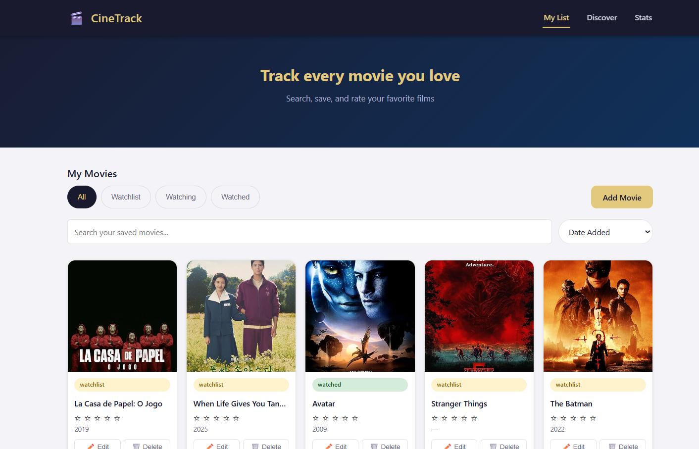
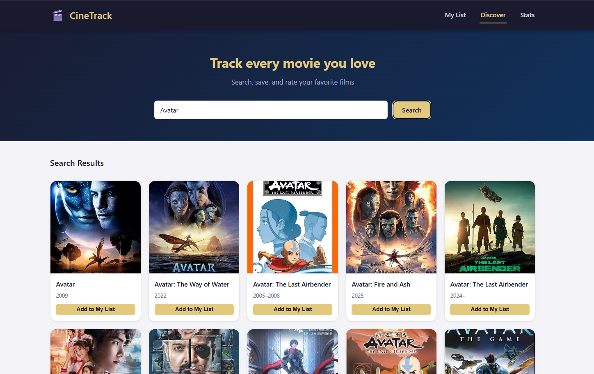
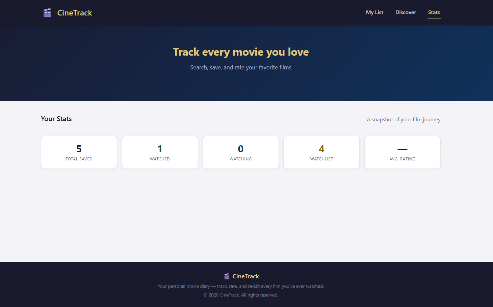

<h1 align="center">🎬 CineTrack</h1>

<p align="center">
A Laravel-based Single Page Application (SPA) for managing personal movie collections.
</p>

<p align="center">
  
  
  
</p>

---

## ✨ Overview

CineTrack is a movie tracking web application that allows users to search, organize, and manage their personal movie library.  
It integrates with the OMDb API to fetch real movie data and provides a smooth SPA experience using AJAX.

---

## 🚀 Features

- 🔍 Search movies using OMDb API  
- 🎞 Add movies to personal library  
- ✏ Update movie details (rating, status, etc.)  
- 🗑 Delete movies  
- ⭐ Rate movies (0–10 scale)  
- 📂 Organize movies by status:
  - Watchlist
  - Watching
  - Watched  
- 🖼 Upload custom movie posters  
- 📊 View personal movie statistics  
- ⚡ Fully AJAX-based SPA (no page reloads)  
- 🔐 Authentication system (Login / Register)  
- 🧪 Automated Laravel testing  

---

## 🛠 Tech Stack

| Technology | Usage |
|---|---|
| Laravel | Backend Framework |
| PHP | Server-side Logic |
| Blade | Templating Engine |
| JavaScript | Frontend Logic |
| AJAX / Fetch API | SPA Communication |
| MySQL / SQLite | Database |
| OMDb API | External Movie Data |
| PHPUnit | Testing |

---

## 🧩 Architecture (MVC)

This project follows Laravel MVC architecture:

- **Models** → Handle database operations  
- **Controllers** → Business logic & request handling  
- **Views (Blade)** → UI rendering  
- **Services** → OMDb API integration logic  

---

## 🔌 API Integration

CineTrack integrates the **OMDb API** to fetch movie information dynamically.

- API calls are handled in Laravel backend (Controller + Service layer)
- API keys are stored securely in `.env`
- Errors are handled gracefully with user-friendly messages

---

## 📸 Screenshots

> Add your screenshots inside a `screenshots/` folder

### 🏠 Home Page


### 🎥 Movie Management


### 📊 Statistics Dashboard


---

## ⚙ Installation

Clone the repository:

```bash
git clone https://github.com/YOUR_USERNAME/CineTrack.git
